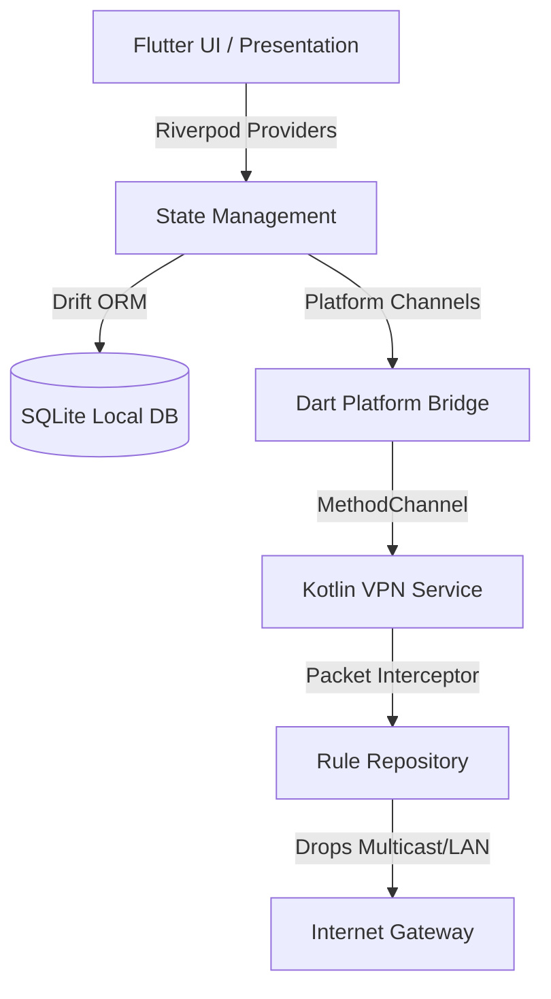

# Network Cloak 🛡️

A premium, high-performance Flutter & Android VPN utility designed to protect mobile devices from local network threats, scan exposure, and untrusted network eavesdropping. 

Network Cloak combines packet-level local shielding, dynamic firewall controls, and real-time network traffic visualization to make your device completely invisible on local area networks (LANs).

---

## 🚀 Key Features

*   **Cloak Engine (Local Shielding)**: Active prevention of LAN exposure. Automatically drops multicast/broadcast discovery packets:
    *   **mDNS** (port `5353`) & **LLMNR** (port `5355`)
    *   **NetBIOS** (ports `137-139`) & **SMB** (port `445`)
    *   **SSDP / UPnP** (port `1900`)
    *   Multicast IP ranges (`224.0.0.0/4`) and Broadcast (`255.255.255.255`)
*   **Watchtower (Real-Time Traffic Monitor)**:
    *   **Live Traffic Speedometer**: Fluid, real-time bandwidth graph powered by custom Canvas cubic Bezier painters.
    *   **Geolocated Connection History**: Active logging of connection attempts with automatic country-flag resolution.
    *   **IP Network Lookup**: Integrated on-demand ARIN RDAP network registry lookup to identify target servers.
*   **Dynamic Firewall**: Custom per-app rules (Allow, Ask, Block) handled by a native Android VPN interceptor.
*   **DNS Guard**: Safe DNS resolution and domain-level query filtering.
*   **Stealth Theme Engine**: Custom, dynamic light and dark (Stealth) modes that sync instantly across native components and the UI.

---

## 🛠️ Architecture & Tech Stack



*   **Frontend**: Flutter (Dart), Flutter Riverpod (State management), GoRouter (Declarative navigation).
*   **Database**: SQLite via Drift ORM for quick, asynchronous write-ahead logging of connection history.
*   **Android Native**: Kotlin-based `VpnService` backend that registers a virtual network interface, parses IP/TCP/UDP packet headers, and applies security rules.

---

## 📂 Project Structure

```
Network Cloak/
├── android/                   # Kotlin VPN implementation & unit tests
│   └── app/src/main/kotlin/com/networkcloak/network_cloak/
│       ├── NetworkCloakVpnService.kt   # Core VpnService runner
│       ├── RuleRepository.kt           # Local rules and Cloak engine
│       └── PlatformChannelHandler.kt   # Method channel communication
├── lib/                       # Flutter Application source code
│   ├── app/
│   │   ├── theme/             # NcColors, NcTextStyles, AppTheme (Light & Dark)
│   │   └── router.dart        # GoRouter navigation schema
│   ├── data/
│   │   └── database/          # AppDatabase using Drift SQLite
│   ├── domain/                # Shared model definitions and enums
│   ├── platform/              # Platform Channel bridge integrations
│   └── presentation/          # Feature-based presentation screens
│       ├── watchtower/        # Real-time traffic speed graph and logs
│       ├── firewall/          # Firewall configuration and rule editors
│       ├── settings/          # Cloak Engine options, Appearance, and About
│       └── onboarding/        # First-run guided setup
└── test/                      # Flutter Dart widget & unit tests
```

---

## ⚙️ Getting Started

### Prerequisites
*   [Flutter SDK](https://docs.flutter.dev/get-started/install) (v3.10.7 or later)
*   [Android SDK](https://developer.android.com/studio) (API Level 21+ required)

### Run the App
1.  Clone the repository and navigate to the project directory:
    ```bash
    cd "Network Cloak"
    ```
2.  Install dependencies:
    ```bash
    flutter pub get
    ```
3.  Generate data models and database code bindings:
    ```bash
    flutter pub run build_runner build --delete-conflicting-outputs
    ```
4.  Run the application on a connected device/emulator:
    ```bash
    flutter run
    ```

---

## 🧪 Testing

### Flutter (Dart) Tests
Run unit and widget tests:
```bash
flutter test
```

### Android (Kotlin) Tests
Verify native rule parsing and the packet blocking engine:
```bash
cd android
./gradlew test
```

### Static Analysis
Run static analysis checks:
```bash
flutter analyze
```
